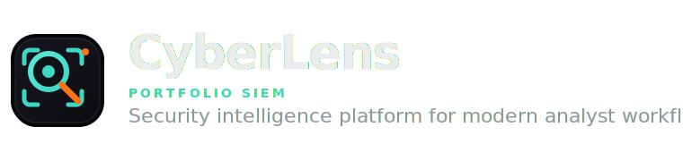
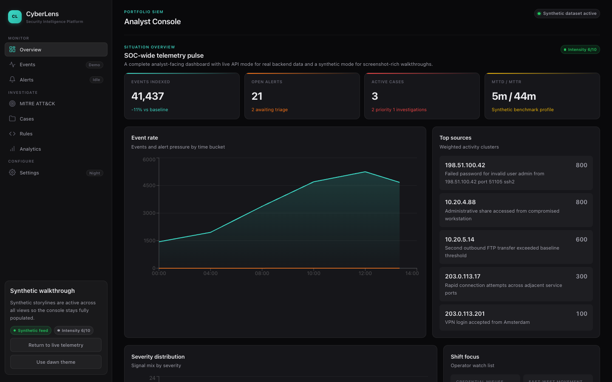
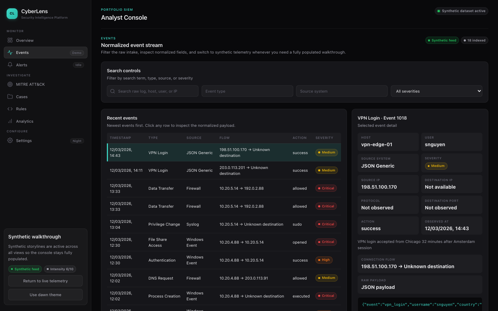
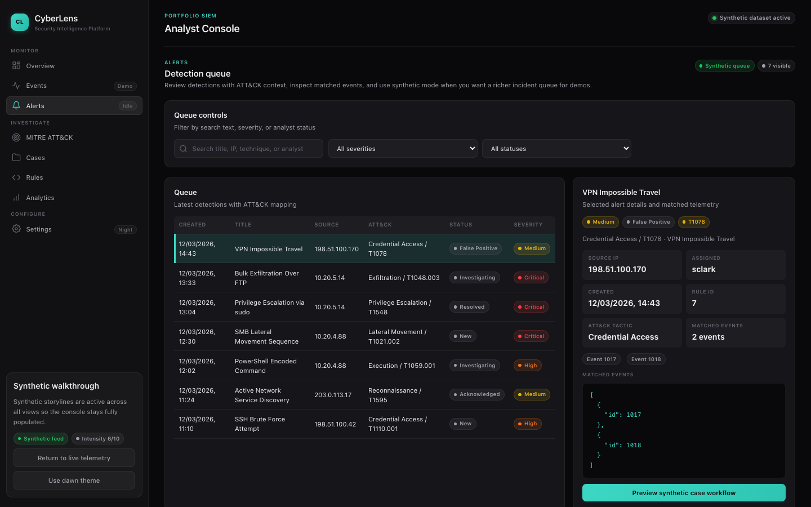
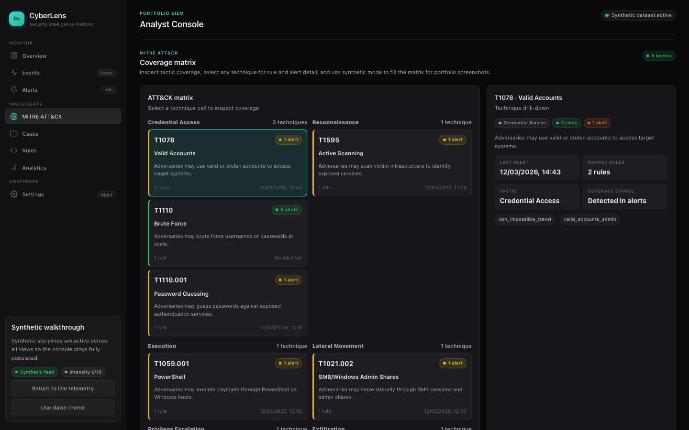
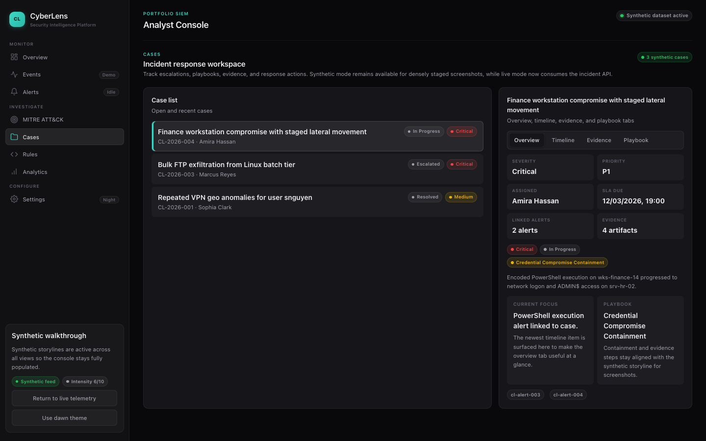
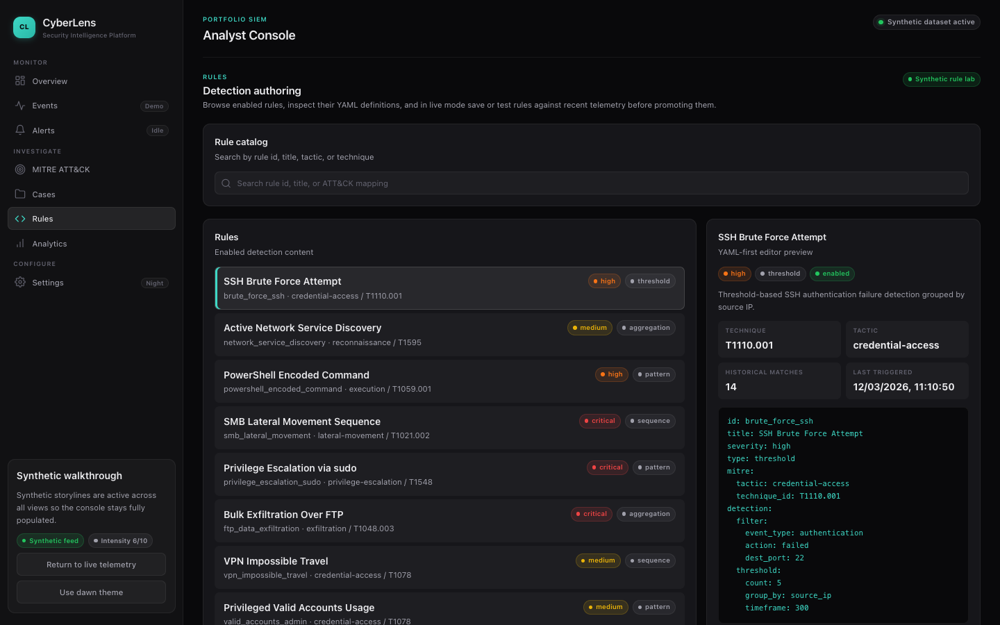
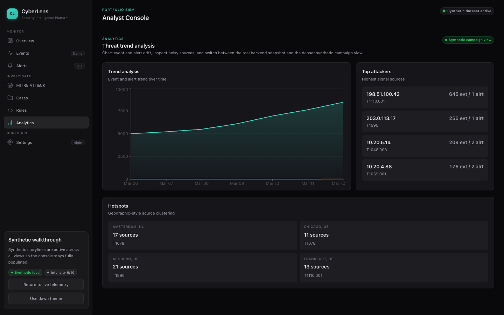
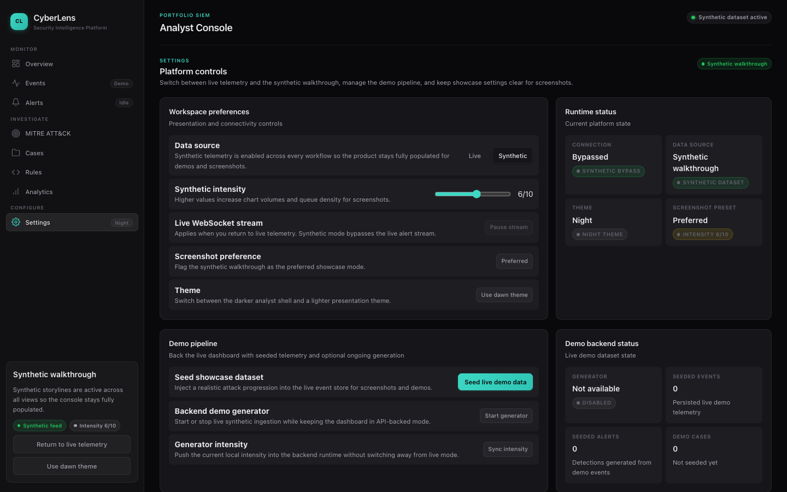

<p align="center">
  <picture>
    <source media="(prefers-color-scheme: dark)" srcset="frontend/public/branding/cyberlens-lockup-night.svg">
    <source media="(prefers-color-scheme: light)" srcset="frontend/public/branding/cyberlens-lockup-dawn.svg">
    
  </picture>
</p>

# CyberLens SIEM

[](https://github.com/d4vjd/CyberLens/actions/workflows/ci.yml)
[](https://github.com/d4vjd/CyberLens/actions/workflows/codeql.yml)
[](LICENSE)

A portfolio-grade Security Information and Event Management (SIEM) application built for professional SOC workflows: log intake, real-time detection, MITRE ATT&CK coverage mapping, incident response, and demo-friendly showcase data.

CyberLens runs as a single Docker Compose stack (FastAPI · React · MySQL · Redis · nginx) and ships with a seeded attack campaign plus optional live synthetic generation for portfolio screenshots.

<br />
<p align="center">
  
</p>
<br />

---

## Table of Contents

- [CyberLens SIEM](#cyberlens-siem)
  - [Table of Contents](#table-of-contents)
  - [Features](#features)
  - [Gallery](#gallery)
  - [Tech Stack](#tech-stack)
  - [Project Structure](#project-structure)
  - [Prerequisites](#prerequisites)
  - [Quick Start](#quick-start)
  - [Demo Workflow](#demo-workflow)
  - [Development](#development)
  - [Available Make Targets](#available-make-targets)
  - [Documentation](#documentation)
  - [Contributing](#contributing)
  - [License](#license)
  - [App Showcase](#app-showcase)
    - [Detailed Investigations](#detailed-investigations)
    - [Incident Response](#incident-response)
    - [Rule Authoring \& Detection Strategies](#rule-authoring--detection-strategies)
    - [High-level Overview](#high-level-overview)

---

## Features

- **Log Ingestion** — REST endpoints for raw and batch log intake plus a syslog receiver (UDP/TCP) inside the Compose stack.
- **Parser Registry** — Built-in parsers for syslog, Windows events, firewall logs, NetFlow-style logs, JSON logs, and a generic text fallback.
- **Real-Time Detection** — Redis Stream-backed detection engine generating alerts from threshold, pattern, sequence, and aggregation rules defined in YAML.
- **MITRE ATT&CK Mapping** — Bundled ATT&CK subset with API-driven matrix coverage derived from live rules and alerts.
- **Rule Authoring** — Live rule editing with YAML save, catalog reload, and historical test-against-telemetry support.
- **Incident Response** — Case creation, alert escalation, comments, playbook execution, evidence uploads, and simulated response actions.
- **Analytics** — Overview API powering live trend and top-source dashboards.
- **Demo Mode** — Seeded showcase telemetry and optional background synthetic event generation for dense, screenshot-ready views.
- **Dashboard UI** — React + TypeScript frontend with 8 routed pages and a custom dark visual system, including a synthetic mode toggle.
- **CI/CD** — GitHub Actions workflows for lint, test, security scan (Bandit + CodeQL), and frontend build verification.

---

## Gallery

<details>
<summary><strong>View Application Screenshots</strong></summary>

<br />

| Events Exploration | Alerts & Detection |
| :---: | :---: |
|  |  |
| **MITRE ATT&CK Mapping** | **Incident Response (Cases)** |
|  |  |
| **Rule Authoring** | **Analytics & Trends** |
|  |  |
| **System Settings** | |
|  | |

</details>

---

## Tech Stack

| Layer | Technology |
|---|---|
| **Backend** | Python 3.12 · FastAPI · SQLAlchemy 2.0 (async) · Alembic · Pydantic · structlog |
| **Frontend** | React 18 · TypeScript · Vite · React Router · TanStack Query · Recharts · Zustand |
| **Database** | MySQL 8.4 |
| **Cache / Streaming** | Redis 7.4 |
| **Reverse Proxy** | nginx |
| **Containerization** | Docker · Docker Compose |
| **CI** | GitHub Actions · Ruff · mypy · Bandit · CodeQL |

---

## Project Structure

```
siem/
├── backend/                  # FastAPI application
│   ├── src/cyberlens/        # Application source
│   │   ├── analytics/        # Trend and overview analytics
│   │   ├── common/           # Shared utilities
│   │   ├── db/               # SQLAlchemy models and sessions
│   │   ├── demo/             # Seed and synthetic generator
│   │   ├── detection/        # Rule engine and evaluators
│   │   ├── incidents/        # Case management and playbooks
│   │   ├── ingestion/        # Log parsers and ingest endpoints
│   │   ├── mitre/            # ATT&CK bundle and coverage API
│   │   ├── settings/         # Analyst and system config APIs
│   │   ├── streaming/        # Redis stream consumer + WebSocket bridge
│   │   ├── config.py         # Pydantic settings
│   │   └── main.py           # App factory and lifespan
│   ├── alembic/              # Database migrations
│   ├── tests/                # pytest test suite
│   ├── Dockerfile            # Production image
│   └── Dockerfile.dev        # Dev image with hot reload
├── frontend/                 # React + Vite application
│   └── src/
│       ├── app/              # App shell and routing
│       ├── features/         # Feature modules (overview, events, alerts, …)
│       ├── shared/           # Shared components and hooks
│       └── styles/           # Global CSS and design tokens
├── nginx/                    # Reverse proxy config
├── rules/                    # YAML detection rules (Sigma-inspired)
├── playbooks/                # YAML incident response playbooks
├── docs/                     # Extended documentation
├── .github/workflows/        # CI and CodeQL workflows
├── docker-compose.yml        # Production stack
├── docker-compose.dev.yml    # Dev override (hot reload, host ports)
├── Makefile                  # Common dev shortcuts
└── .env.example              # Environment variable template
```

---

## Prerequisites

- **Docker** ≥ 24.0 and **Docker Compose** ≥ 2.20 (the Compose plugin, not the legacy `docker-compose` binary)
- **Make** (optional, for shortcut targets)
- No local Python or Node.js installation is required — everything runs inside containers.

---

## Quick Start

```bash
# 1. Clone the repository
git clone https://github.com/d4vjd/CyberLens.git
cd CyberLens

# 2. (Optional) Override default environment variables
cp .env.example .env

# 3. Build and start all services
docker compose up --build

# 4. Open the dashboard
open http://localhost

# 5. Verify the API health endpoint
curl http://localhost/api/v1/health

# 6. (Optional) Seed demo data for populated dashboards
make seed
```

The stack exposes:

| Service | URL |
|---|---|
| Dashboard (nginx → frontend) | [http://localhost](http://localhost) |
| API (nginx → backend) | [http://localhost/api/v1/…](http://localhost/api/v1/health) |
| Syslog listener | `TCP/UDP 514` |

---

## Demo Workflow

CyberLens ships with two complementary demo modes for capturing portfolio screenshots:

1. **Live mode** — Use the Settings page or `make seed` to inject a realistic attack campaign into the live datastore. Dashboards pull from the real API.
2. **Synthetic mode** — Toggle from the UI to display a dense local showcase dataset without touching the backend state. Useful for instant, repeatable screenshots.

You can also start a background demo generator from Settings to keep live alerts, cases, and analytics moving continuously.

---

## Development

Use the dev override stack for hot reload on both backend and frontend:

```bash
docker compose -f docker-compose.yml -f docker-compose.dev.yml up --build
```

| Service | Host Port | Notes |
|---|---|---|
| Backend (uvicorn) | `8000` | Auto-reloads on Python file changes |
| Frontend (Vite) | `5173` | HMR enabled |
| nginx | `8080` | Proxies to both services |
| Syslog | `5514` | Avoids privileged port 514 on the host |

See [docs/development.md](docs/development.md) for full details including syslog ingestion and demo data setup.

---

## Available Make Targets

| Target | Description |
|---|---|
| `make up` | Build and start the production stack |
| `make down` | Stop all services and remove orphan containers |
| `make build` | Build container images without starting |
| `make migrate` | Run Alembic migrations inside the backend container |
| `make seed` | Seed demo data via the REST API |
| `make test` | Run backend pytest suite with coverage |
| `make lint` | Run Ruff, mypy, and Bandit on the backend; build-check the frontend |
| `make logs` | Tail live logs from all services |

---

## Documentation

Extended documentation is located in the [`docs/`](docs/) directory:

- [Architecture](docs/architecture.md) — Runtime flow, service topology, and startup sequence
- [API Reference](docs/api-reference.md) — Complete endpoint listing with ingestion, detection, and incident response notes
- [Detection Rules](docs/detection-rules.md) — YAML rule schema, supported rule types, and examples
- [Development](docs/development.md) — Local development setup, syslog ingestion, and demo data
- [Deployment](docs/deployment.md) — Production and development deployment guidance

---

## Contributing

See [CONTRIBUTING.md](CONTRIBUTING.md) for development flow, coding standards, and pull request guidelines.

---

## License

This project is licensed under the [Hippocratic License 3.0](LICENSE).

---

## App Showcase

Take a closer look at the CyberLens interface in action:

### Detailed Investigations
The events explorer allowing complex querying and deep-dive investigations:


<br/>

### Incident Response
A seamless workflow for analysts to review alerts, handle cases, and document findings:


<br/>

### Rule Authoring & Detection Strategies
Live edit yaml detection rules, perform syntax checks, and test backwards on historical data:


<br/>

### High-level Overview
Visualize your security posture and track activity trends at a glance:
