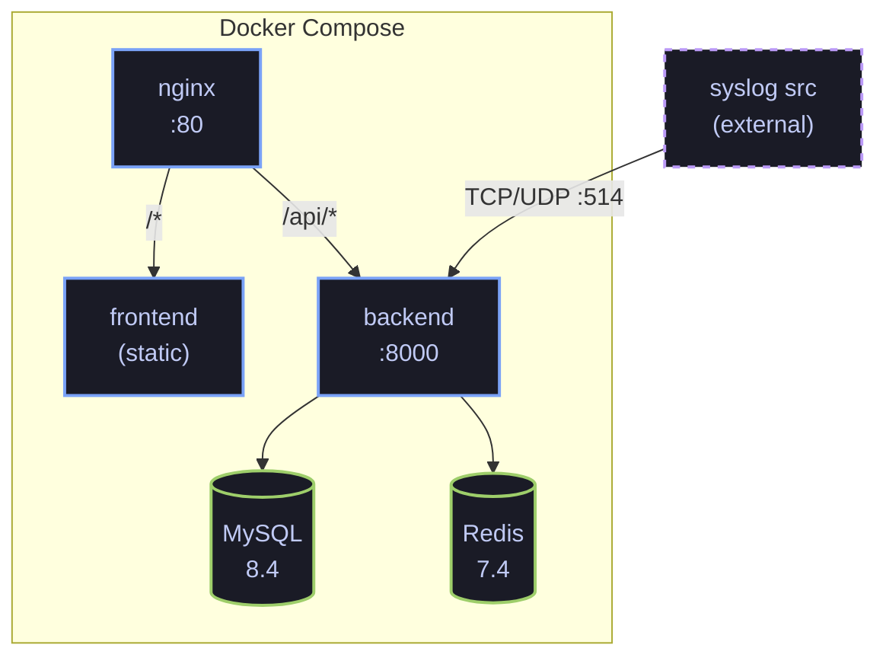

# Architecture

CyberLens is structured as a FastAPI backend with MySQL persistence, Redis-backed streaming, and a React/Vite dashboard served through nginx.

## Service Topology

- **nginx** — Reverse proxy on port `80`. Routes `/api/*` to the backend and all other paths to the frontend.
- **frontend** — Static React/Vite build served by nginx in production; Vite dev server with HMR in development.
- **backend** — FastAPI application (uvicorn). Owns all business logic, detection, and data access.
- **MySQL 8.4** — Relational persistence for events, alerts, rules, cases, and system config.
- **Redis 7.4** — Event stream (`cyberlens:events`) for real-time detection, alert pub/sub (`cyberlens:alerts`) for WebSocket fan-out, and stateful detection primitives (counters, sliding windows).

## Runtime Flow

1. Logs arrive via the REST ingestion endpoints (`POST /api/v1/ingest/raw`, `POST /api/v1/ingest/batch`), the syslog listener, or the live baseline emitter.
2. Events are normalised through the parser registry and persisted to the `events` table.
3. Normalised events are published to the Redis event stream.
4. The detection engine consumes the stream and evaluates active rules (threshold, pattern, sequence, aggregation).
5. Generated alerts are written to the `alerts` table with MITRE ATT&CK technique mappings.
6. Alerts are published to the `cyberlens:alerts` channel for downstream WebSocket fan-out to connected dashboards.
7. Analysts can escalate alerts into cases, execute playbooks, upload evidence, and trigger simulated response actions.
8. The live baseline emitter sends health probes, service heartbeats, and routine network flows through the same parser and persistence path as external telemetry.
9. Scenario seeding and the optional synthetic generator use the same datastore and detection services when walkthrough traffic is explicitly requested.

## Backend Startup Sequence

On application startup, the backend lifespan hook:

1. Connects to MySQL and runs Alembic migrations (in the dev stack).
2. Loads the bundled MITRE ATT&CK subset into memory.
3. Syncs YAML rules from `rules/` into the `detection_rules` table.
4. Starts the Redis Stream detection consumer (background task).
5. Starts the alert WebSocket bridge (background task).
6. Optionally starts the syslog listener based on the `SYSLOG_ENABLED` environment variable.
7. Starts the live baseline emitter so the platform has genuine operational telemetry in live mode.

## Database Schema

The MySQL schema covers 11 core tables managed by Alembic:

| Table | Purpose |
|---|---|
| `events` | Normalised log events |
| `alerts` | Detection-generated alerts with severity and MITRE mappings |
| `detection_rules` | Active detection rule catalog (synced from YAML) |
| `cases` | Incident response cases |
| `case_alerts` | Many-to-many link between cases and escalated alerts |
| `case_comments` | Analyst comments on cases |
| `case_evidence` | Uploaded evidence files linked to cases |
| `response_actions` | Simulated response actions executed on cases |
| `playbooks` | Incident response playbook definitions |
| `analysts` | SOC analyst roster |
| `system_config` | Runtime configuration and scenario/baseline state |

## Detection Rule Types

| Type | Behaviour |
|---|---|
| **Threshold** | Fires when event count exceeds a threshold within a sliding window, grouped by a key field. |
| **Pattern** | Fires when a single event matches a field-level condition set. |
| **Sequence** | Fires when an ordered sequence of event patterns occurs within a time window. |
| **Aggregation** | Fires when an aggregate metric (count, sum, avg) over a field exceeds a threshold in a window. |
]]>
